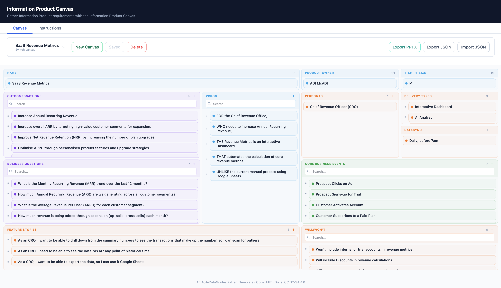

# Information Product Canvas

Gather Information Product requirements using the Information Product Canvas pattern template. Define business questions, outcomes, personas, delivery types, core business events, feature stories, will/wont's and vision for each Information Product.

An [AgileDataGuides](https://agiledataguides.com/agiledata-templates/) Pattern Template app.

## What It Does

The Information Product Canvas is a visual requirements tool for Information Products. Each canvas captures everything needed to design and deliver an Information Product:

| Section | Purpose |
|---------|---------|
| **Name** | The Information Product name and description |
| **Product Owner** | Who owns this product |
| **T-Shirt Size** | Effort estimate |
| **Business Questions** | What questions does this product answer |
| **Outcomes/Actions** | What actions and outcomes result from answering the questions |
| **Personas** | Who consumes this product |
| **Vision** | Vision statements for this product |
| **Delivery Types** | How the product is delivered (e.g. Dashboard, Report, API) |
| **Data Sync** | How often data is refreshed (e.g. Real-time, Hourly, Daily) |
| **Core Business Events** | What events create the data that feeds the product |
| **Feature Stories** | User stories in "As a... I want... so that..." format |
| **Will/Won't** | Explicit scope: what's in and what's out |

## Install and Run

Double-click `start-IPC.command` (macOS) or run `./start-IPC.sh` from the terminal.

The app starts at [http://localhost:5115](http://localhost:5115).

**Requires**: [Node.js](https://nodejs.org/) (v18+) and [pnpm](https://pnpm.io/) (`npm install -g pnpm`).

## Features

- **Multiple canvases** — create, switch between, and delete IPC models
- **Inline editing** — click any card to select; double-click to rename
- **Auto-save** — changes persist to browser localStorage
- **Export JSON** — download the canvas to share or re-import
- **Import JSON** — load a previously exported canvas
- **Export PPTX** — generate a PowerPoint slide per Information Product
- **Save to disk** — writes JSON to `data/` for direct access by Claude or other tools

## Works With Claude

Export your canvas as JSON and use it with [Claude Code](https://claude.ai/claude-code) or [Claude Chat](https://claude.ai):

- *"Who is this product built for?"*
- *"Do my business questions align with what my personas actually need?"*
- *"Draft a concept model based on my canvas"*
- *"Suggest metrics and their definitions for this product"*
- *"This feels too big — suggest a way to break it into smaller IPCs"*

## Data Storage

**Save** writes canvas files to the `data/` folder as JSON. This only works in dev mode (`pnpm dev`) where the server can write to disk. Claude Code can then read these files directly.

**Export** downloads files to your browser's downloads folder for sharing or backup.

**Auto-save** persists the current state to browser localStorage automatically.

## Security

This app is designed to run locally on your own machine. Do not expose it to the internet or deploy it on a public server. The Save feature writes files directly to your filesystem. There is no user authentication, so anyone who can reach the server can read and overwrite your data.

If you need to share your work, use the **Export** buttons to download files and share them manually.

## Tech Stack

- [SvelteKit 5](https://svelte.dev/) with Svelte 5 runes
- [Tailwind CSS 4](https://tailwindcss.com/)
- TypeScript
- pnpm

## Learn More

## 📗 Learn More

**Learn how to fill out your first canvas in 30 minutes.**

Get the full guide — *An Agile Data Guide to Information Product Canvas* — as an ePub for just $12. Use code **parsecs** at checkout, or [click here to get the discount applied automatically](https://ebooks.agiledataguides.com/discount/parsecs?redirect=%2Fproducts%2Fan-agile-data-guide-to-information-product-canvas).

While you can use the Information Product Canvas app on its own, the full guide walks you through every canvas area with real-world examples, proven patterns, and tips from 10+ years of coaching data teams.

## Licensing

- **Code**: [MIT](./LICENSE)
- **Documentation**: [CC BY-SA 4.0](./docs/LICENSE)
